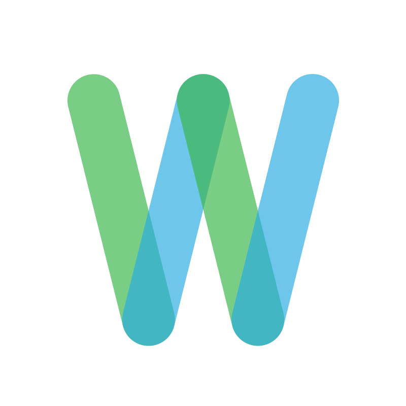
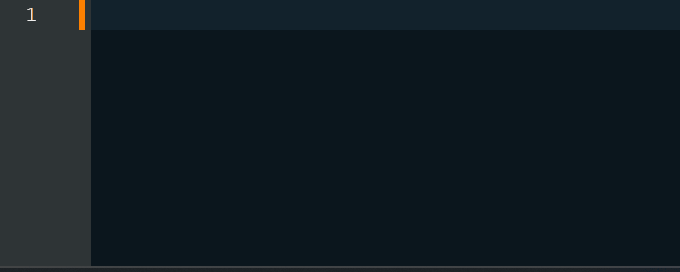
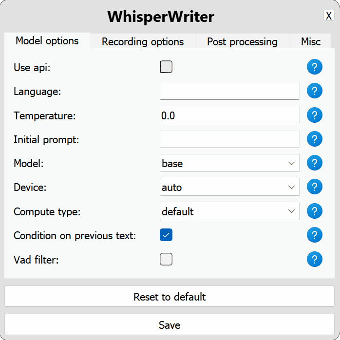

#  AsklaionTyper


<p align="center">
    
</p>

**AsklaionTyper** ist ein persönlich angepasster Fork von [WhisperWriter](https://github.com/savbell/whisper-writer) — eine kleine Diktier-App, die [OpenAIs Whisper-Modell](https://openai.com/research/whisper) nutzt, um Sprache vom Mikrofon direkt in das aktive Fenster zu transkribieren.

Im Hintergrund wartet die App auf einen Tastatur-Shortcut (Standard: `Strg + Shift + Leertaste`). Sobald der Shortcut gedrückt wird, beginnt die Aufnahme. Die Transkription wird anschließend automatisch in das aktuell aktive Fenster getippt — egal ob Word, Browser, Mail oder Praxis-Software.

## Was unterscheidet AsklaionTyper von WhisperWriter?

Dieser Fork ist auf den deutschen Workflow optimiert, insbesondere für medizinische Diktate:

- **Deutsche Voreinstellungen:** `language: de`, `model: large-v3`, deutscher `initial_prompt` für korrekte Groß-/Kleinschreibung und Satzzeichen.
- **Clipboard-Eingabemethode (`input_method: clipboard`):** Statt Zeichen-für-Zeichen über pynput wird der Text via Zwischenablage und `Strg+V` eingefügt. Das löst das bekannte Problem, dass Umlaute (`ä`, `ö`, `ü`, `ß`) und andere Nicht-ASCII-Zeichen auf Windows beim Per-Char-Typen fehlerhaft eingefügt werden.
- **Robuster Modell-Start:** Automatisches Warmup nach dem Laden, plus Fallback auf CPU, falls die CUDA-Initialisierung fehlschlägt.
- **`start.bat` für Windows:** Aktiviert das venv, setzt die CUDA-/cuDNN-Pfade aus dem venv in den `PATH` und startet die App mit einem Doppelklick.

Die ursprüngliche WhisperWriter-Funktionalität bleibt komplett erhalten — siehe Abschnitte unten.

## Aufnahmemodi

- `continuous` *(Standard)* — Aufnahme stoppt nach einer Sprechpause, wird sofort transkribiert und startet dann automatisch erneut. Beenden mit dem Shortcut.
- `voice_activity_detection` — Aufnahme stoppt nach einer Sprechpause; Neustart erst beim nächsten Drücken des Shortcuts.
- `press_to_toggle` — Aufnahme läuft, bis der Shortcut erneut gedrückt wird.
- `hold_to_record` — Aufnahme läuft, solange der Shortcut gehalten wird.

Die Transkription erfolgt entweder lokal über [faster-whisper](https://github.com/SYSTRAN/faster-whisper/) (Standard) oder per [OpenAI-API](https://platform.openai.com/docs/guides/speech-to-text). Beides lässt sich im Settings-Fenster umstellen.

## Schnellstart (Windows)

### Voraussetzungen

- [Git](https://git-scm.com/downloads)
- [Python 3.11](https://www.python.org/downloads/)
- Für GPU-Beschleunigung: NVIDIA-GPU mit [cuBLAS für CUDA 12](https://developer.nvidia.com/cublas) und [cuDNN 8 für CUDA 12](https://developer.nvidia.com/cudnn)

> **Hinweis zu cuDNN:** `nvidia-cudnn-cu12` ab Version 9 ist mit faster-whisper nicht kompatibel — bei cuDNN 8 bleiben.

<details>
<summary>Alternative cuDNN-Installation für Windows</summary>

Statt der offiziellen NVIDIA-Pakete kannst du das vorgepackte Archiv von [Purfview/whisper-standalone-win](https://github.com/Purfview/whisper-standalone-win/releases/tag/libs) entpacken und den Ordner in den `PATH` aufnehmen. `start.bat` setzt zusätzlich die DLL-Pfade aus dem venv in den `PATH`, falls du `nvidia-cublas-cu12` und `nvidia-cudnn-cu12` per pip installierst.
</details>

### Installation

```bash
git clone https://github.com/lollylan/AsklaionTyper
cd AsklaionTyper

python -m venv venv
venv\Scripts\activate

pip install -r requirements.txt
```

### Starten

**Variante 1 — Doppelklick:**

```
start.bat
```

**Variante 2 — manuell:**

```bash
venv\Scripts\activate
python run.py
```

Beim ersten Start öffnet sich das Settings-Fenster. Nach dem Speichern erscheint das Hauptfenster — `Start` klicken, dann mit `Strg + Shift + Leertaste` aufnehmen und transkribieren.

## Konfiguration

Die Einstellungen werden im Settings-Fenster verwaltet und in `src/config.yaml` gespeichert. Diese Datei ist absichtlich `.gitignore`-d, damit deine persönlichen Einstellungen (inkl. eventueller API-Keys) nicht versehentlich gepusht werden. Das vollständige Schema mit allen Defaults und Optionen findest du in [`src/config_schema.yaml`](src/config_schema.yaml).

<p align="center">
    
</p>

### Wichtigste Optionen für deutsche Diktate

| Bereich | Option | Empfehlung | Wirkung |
| --- | --- | --- | --- |
| `model_options.common` | `language` | `de` | Erzwingt deutsches Sprachmodell statt Auto-Detection. |
| `model_options.common` | `initial_prompt` | dt. Beispielsatz | Verbessert Groß-/Kleinschreibung & Zeichensetzung. |
| `model_options.local` | `model` | `large-v3` | Beste Genauigkeit; benötigt GPU mit ≥ 6 GB VRAM. |
| `model_options.local` | `device` | `cuda` / `auto` | GPU-Beschleunigung. |
| `model_options.local` | `compute_type` | `float16` | Schneller auf modernen GPUs. |
| `recording_options` | `activation_key` | `ctrl+shift+space` | Globaler Shortcut. |
| `recording_options` | `recording_mode` | `continuous` | Diktatfluss ohne wiederholtes Drücken. |
| `post_processing` | `input_method` | `clipboard` | Robust für Umlaute auf Windows. |

Die übrigen Optionen (Sample-Rate, Sound-Device, Pausenlängen, etc.) sind im [`config_schema.yaml`](src/config_schema.yaml) dokumentiert.

## Bekannte Probleme

- **Umlaute werden zerschossen:** `input_method` auf `clipboard` setzen (Standard in diesem Fork).
- **CUDA out of memory:** Auf kleineres Modell wechseln (`medium`, `small`) oder `compute_type` auf `int8` setzen — letzteres erzwingt CPU.
- **App startet nicht / DLL-Fehler:** cuDNN-Version prüfen (Version 8 erforderlich, nicht 9).

Original-Issues und Workarounds aus dem Upstream-Projekt: [savbell/whisper-writer/issues](https://github.com/savbell/whisper-writer/issues).

## Roadmap

- [x] Clipboard-Eingabe für Umlaute
- [x] Modell-Warmup nach Laden
- [x] CPU-Fallback bei CUDA-Fehler
- [ ] Wortersetzungen (z. B. „Punkt“ → „.“, Diktatkürzel → Ausdrücke)
- [ ] Optionale GPT-Nachbearbeitung für Strukturierung medizinischer Diktate

Detaillierte Änderungshistorie: [CHANGELOG.md](CHANGELOG.md).

## Credits

- [savbell/whisper-writer](https://github.com/savbell/whisper-writer) — das ursprüngliche Projekt, auf dem AsklaionTyper basiert.
- [OpenAI](https://openai.com/) für das Whisper-Modell.
- [Guillaume Klein](https://github.com/guillaumekln) und SYSTRAN für [faster-whisper](https://github.com/SYSTRAN/faster-whisper).

## Lizenz

GNU General Public License v3.0 — siehe [LICENSE](LICENSE).
